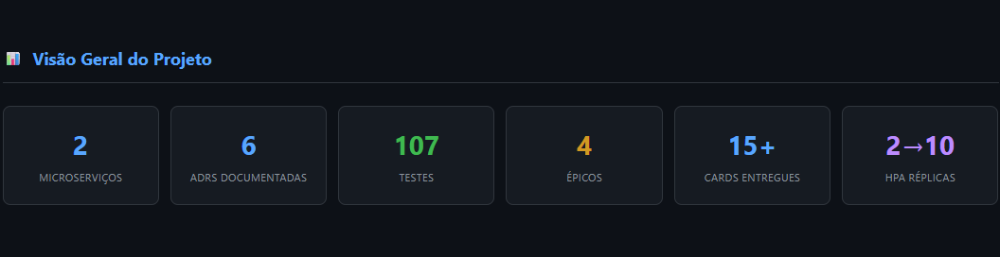
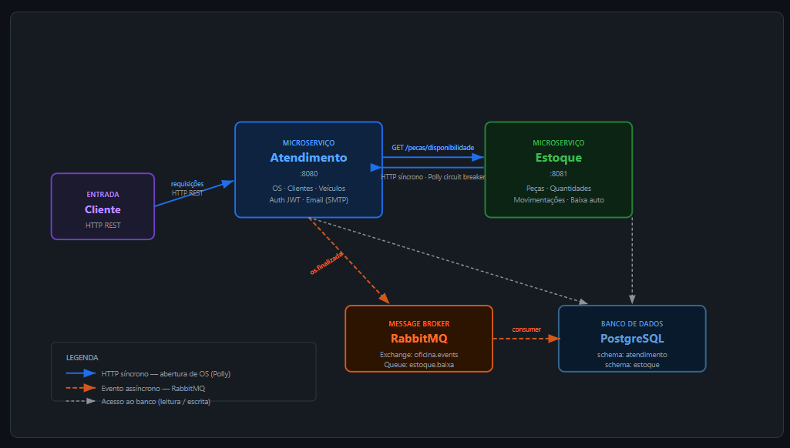
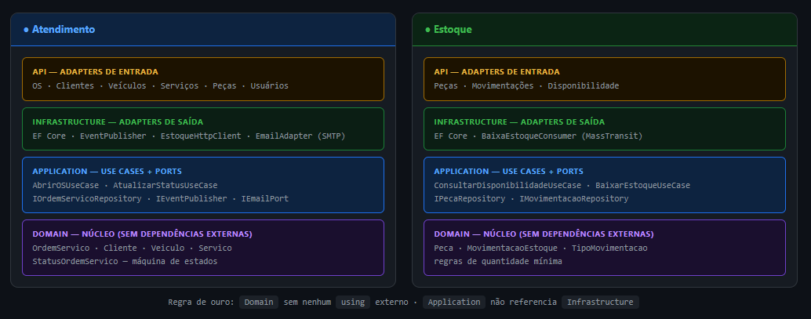
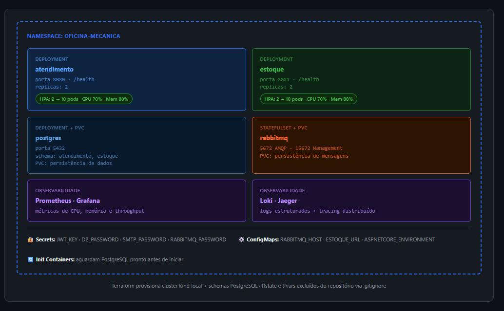
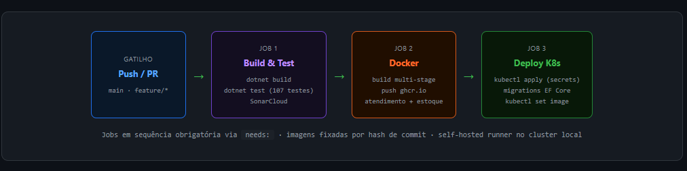

# Tech Challenge — Oficina Mecânica


Oficinas mecânicas gerenciam ordens de serviço, controle de peças e comunicação com clientes de forma manual ou em sistemas monolíticos que não escalam. Este projeto resolve esse problema com uma plataforma back-end distribuída: dois microsserviços independentes que cobrem o ciclo completo de uma OS — da abertura à baixa automática de estoque — com rastreabilidade, resiliência a falhas e observabilidade em produção.

Projeto de pós-graduação em Software Architecture — FIAP.

---

## Início rápido

```bash
# 1. Clone e configure as variáveis de ambiente
git clone https://github.com/LucazDenadai/tech-challenge.git
cd tech-challenge
cp .env.example .env

# 2. Suba tudo
docker compose up --build
```

Em ~30 segundos:
- Atendimento API → http://localhost:8080/swagger
- Estoque API → http://localhost:8081/swagger
- RabbitMQ UI → http://localhost:15672 (`guest` / `guest`)

Login padrão: `admin@oficina.com` / `Admin@123`

---

## O que o sistema faz

Uma ordem de serviço nasce no **Atendimento** — o atendente cadastra o cliente, o veículo e os serviços a executar. Ao finalizar a OS, um evento é publicado no RabbitMQ e o **Estoque** o consome de forma assíncrona, dando baixa automática nas peças utilizadas. O cliente acompanha o status da OS em tempo real via endpoint público, sem autenticação.

Os dois microsserviços são deployados independentemente, escalam via HPA e se comunicam de forma resiliente: retry automático com backoff, dead letter queue para falhas persistentes e circuit breaker para chamadas HTTP entre serviços.

As principais decisões de arquitetura — por que microsserviços, por que RabbitMQ, por que AWS — estão documentadas em [`tech-challenge-docs`](https://github.com/LucazDenadai/tech-challenge-docs).

---

## Arquitetura

### Visão geral — observabilidade e métricas



### Componentes e comunicação entre serviços



Dois microsserviços com responsabilidades bem delimitadas:

- **Atendimento** expõe a API REST consumida por atendentes e mecânicos. Na abertura de uma OS, faz chamada HTTP síncrona ao Estoque para verificar disponibilidade de peças (via Polly com retry e circuit breaker). Ao finalizar a OS, publica o evento `os.finalizada` no RabbitMQ.
- **Estoque** consome o evento e executa a baixa das peças. Em caso de falha, o MassTransit reprocessa automaticamente (3 tentativas: 1s → 5s → 10s). Após esgotar as tentativas, a mensagem vai para a dead letter queue `estoque.baixa_error` — nenhuma baixa é perdida silenciosamente.

### Arquitetura Hexagonal — camadas por serviço



Cada microsserviço segue a mesma estrutura em quatro camadas: `Domain` (regras de negócio puras, sem dependências externas), `Application` (casos de uso e interfaces de porta), `Infrastructure` (EF Core, RabbitMQ, repositórios) e `API` (controllers, filtros, Program.cs). A camada `Application` nunca referencia `Infrastructure` — a inversão de dependência é enforçada por análise estática.

### Infraestrutura Kubernetes



Cada serviço roda em pods isolados no namespace `oficina-mecanica`, com HPA configurado para escalar entre 2 e 10 réplicas com base em CPU e memória. PostgreSQL e RabbitMQ são deployados no mesmo cluster com PersistentVolumeClaims para durabilidade. A stack de observabilidade (Prometheus, Grafana, Loki, Jaeger) roda no namespace `observabilidade`.

### Fluxo de deploy — CI/CD



```
build-and-test (ubuntu-latest)
       ↓
    infra (self-hosted)   ← terraform init + apply provisiona cluster Kind e PostgreSQL
       ↓
    docker (ubuntu-latest) ← build e push das imagens para GHCR
       ↓
    deploy (self-hosted)  ← kubectl apply dos manifestos K8s
```

Jobs em sequência obrigatória via `needs:` · Terraform orquestrado pelo pipeline (não manual) · imagens fixadas por hash de commit (supply chain) · self-hosted runner no cluster local · `infra` e `deploy` rodam apenas em push para `main`.

---

## Tecnologias

| Categoria | Tecnologia |
|---|---|
| Runtime | .NET 10 / ASP.NET Core |
| Linguagem | C# |
| ORM | Entity Framework Core 9 + Npgsql |
| Banco de dados | PostgreSQL 16 |
| Mensageria | RabbitMQ 3 + MassTransit 8 |
| Autenticação | JWT (HMAC-SHA256) + BCrypt |
| Documentação | Swagger / Swashbuckle |
| Containerização | Docker + Docker Compose |
| Orquestração | Kubernetes 1.31 (Kind local) |
| Infra como código | Terraform >= 1.6 |
| Testes | xUnit + Moq + FluentAssertions + Testcontainers |
| Cobertura | coverlet (OpenCover) |
| Qualidade | SonarAnalyzer for C# + SonarCloud |
| Observabilidade | Prometheus + Grafana + Loki + Promtail + Jaeger |

---

## Estrutura do projeto

```
src/
├── Atendimento/
│   ├── OficinaMecanica.Atendimento.Domain/          # Entidades, enums, regras de negócio
│   ├── OficinaMecanica.Atendimento.Application/     # Use cases, ports (interfaces), eventos
│   ├── OficinaMecanica.Atendimento.Infrastructure/  # EF Core, repositórios, RabbitMQ publisher
│   └── OficinaMecanica.Atendimento.API/             # Controllers, filtros, Program.cs
│
└── Estoque/
    ├── OficinaMecanica.Estoque.Domain/              # Entidades Peca e MovimentacaoEstoque
    ├── OficinaMecanica.Estoque.Application/         # Use cases, ports, eventos
    ├── OficinaMecanica.Estoque.Infrastructure/      # EF Core, repositórios, BaixaEstoqueConsumer
    └── OficinaMecanica.Estoque.API/                 # Controllers, Program.cs

tests/
├── Atendimento/
│   ├── OficinaMecanica.Atendimento.UnitTests/       # Testes unitários dos use cases
│   └── OficinaMecanica.Atendimento.IntegrationTests/# HTTP + PostgreSQL real (Testcontainers)
└── Estoque/
    ├── OficinaMecanica.Estoque.UnitTests/           # Testes unitários dos use cases
    └── OficinaMecanica.Estoque.IntegrationTests/    # HTTP + PostgreSQL real (Testcontainers)

k8s/
├── namespace.yaml
├── atendimento/     # deployment, service, configmap, secret, hpa
├── estoque/         # deployment, service, configmap, secret, hpa
├── postgres/        # deployment, service, secret, pvc
├── rabbitmq/        # statefulset, service, pvc
└── observabilidade/ # prometheus, grafana, loki, promtail, jaeger

docs/
└── images/          # imagens usadas neste README
```

---

## Documentação arquitetural

As decisões de design não óbvias, RFCs, diagramas e os cards de execução estão centralizados no repositório [`tech-challenge-docs`](https://github.com/LucazDenadai/tech-challenge-docs). Cada ADR documenta o contexto, a decisão tomada, as alternativas consideradas e as consequências.

| ADR | Decisão |
|---|---|
| [ADR-001](https://github.com/LucazDenadai/tech-challenge-docs/blob/main/adr/ADR-001-arquitetura-microservicos-mensageria.md) | Por que dois microsserviços em vez de monolito modular |
| [ADR-002](https://github.com/LucazDenadai/tech-challenge-docs/blob/main/adr/ADR-002-observabilidade-falhas-tabela-banco.md) | Rastreamento de falhas em tabela de banco em vez de log externo |
| [ADR-003](https://github.com/LucazDenadai/tech-challenge-docs/blob/main/adr/ADR-003-arquitetura-kubernetes.md) | Estratégia de deploy no Kubernetes (namespaces, HPA, secrets) |
| [ADR-004](https://github.com/LucazDenadai/tech-challenge-docs/blob/main/adr/ADR-004-estoque-fonte-verdade-pecas.md) | Estoque como fonte de verdade para disponibilidade de peças |
| [ADR-005](https://github.com/LucazDenadai/tech-challenge-docs/blob/main/adr/ADR-005-infraestrutura-como-codigo-terraform.md) | Kind local via Terraform (superseded pelo ADR-009) |
| [ADR-006](https://github.com/LucazDenadai/tech-challenge-docs/blob/main/adr/ADR-006-self-hosted-runner-cicd.md) | Self-hosted runner para o deploy (superseded pelo ADR-009) |
| [ADR-007](https://github.com/LucazDenadai/tech-challenge-docs/blob/main/adr/ADR-007-banco-compartilhado-schemas-separados.md) | Banco compartilhado com schemas separados por serviço |
| [ADR-009](https://github.com/LucazDenadai/tech-challenge-docs/blob/main/adr/ADR-009-migracao-aws-e-separacao-repositorios.md) | Migração para AWS e separação em repositórios (Fase 3) |

---

## Pré-requisitos

- [Docker Desktop](https://www.docker.com/products/docker-desktop/) (para rodar tudo com compose)
- [.NET 10 SDK](https://dotnet.microsoft.com/download) (para desenvolvimento local e testes)
- Windows PowerShell 5.1+ ou PowerShell 7+ (para rodar os scripts em `scripts/`)

---

## Como executar localmente

### 1. Configure o arquivo `.env`

```bash
cp .env.example .env
```

O `.env.example` já tem valores prontos para desenvolvimento local.

### 2. Suba tudo com Docker Compose

```bash
docker compose up --build
```

Isso sobe em ordem: PostgreSQL → RabbitMQ → Atendimento API → Estoque API.

### Serviços disponíveis

| Serviço | URL |
|---|---|
| Atendimento API | http://localhost:8080 |
| Atendimento Swagger | http://localhost:8080/swagger |
| Estoque API | http://localhost:8081 |
| Estoque Swagger | http://localhost:8081/swagger |
| RabbitMQ Management UI | http://localhost:15672 (guest / guest) |

---

## Deploy em Kubernetes

### Pré-requisitos

- `kubectl` configurado apontando para o cluster
- Imagens publicadas no GHCR via CI/CD (ou substituir pelas suas)

### Passo a passo

```bash
# 1. Criar namespace
kubectl apply -f k8s/namespace.yaml

# 2. Criar secrets (substituir pelos valores reais)
kubectl create secret generic atendimento-secrets \
  --from-literal=Jwt__Key=<chave-minimo-32-chars> \
  --from-literal=ConnectionStrings__DefaultConnection="Host=postgres-svc;Port=5432;Database=oficina_atendimento;Username=postgres;Password=<senha>" \
  -n oficina-mecanica

kubectl create secret generic estoque-secrets \
  --from-literal=ConnectionStrings__DefaultConnection="Host=postgres-svc;Port=5432;Database=oficina_estoque;Username=postgres;Password=<senha>" \
  -n oficina-mecanica

# 3. Aplicar manifestos
kubectl apply -f k8s/ -n oficina-mecanica
kubectl apply -f k8s/observabilidade/ -n observabilidade

# 4. Acompanhar rollout
kubectl rollout status deployment/atendimento -n oficina-mecanica
kubectl rollout status deployment/estoque -n oficina-mecanica

# 5. Verificar HPA
kubectl get hpa -n oficina-mecanica

# 6. Verificar serviços e pods
kubectl get svc -n oficina-mecanica
kubectl get pods -n oficina-mecanica
```

> **Nota:** o startup da API cria o banco automaticamente se não existir e roda as migrations do EF Core.

---

## Provisionamento com Terraform

A infraestrutura (cluster Kubernetes e banco de dados) foi extraída para repositórios próprios, cada um com seu próprio Terraform e CI/CD — ver [ADR-009](https://github.com/LucazDenadai/tech-challenge-docs/blob/main/adr/ADR-009-migracao-aws-e-separacao-repositorios.md).

| Repositório | O que provisiona |
|---|---|
| [tech-challenge-infra-k8s](https://github.com/LucazDenadai/tech-challenge-infra-k8s) | Cluster Kubernetes, namespaces `oficina-mecanica` e `observabilidade` |
| [tech-challenge-infra-db](https://github.com/LucazDenadai/tech-challenge-infra-db) | Banco de dados PostgreSQL, schemas `atendimento` e `estoque` |

Aplique `tech-challenge-infra-k8s` primeiro, depois `tech-challenge-infra-db` (o banco depende da rede criada pelo cluster). Instruções completas de execução estão no README de cada repositório.

---

## APIs — Swagger e Postman

A collection completa do Postman com todos os endpoints está disponível em: https://github.com/LucazDenadai/tech-challenge/blob/main/docs/oficina-mecanica.postman_collection.json

Importe no Postman e configure a variável `baseUrl` para `http://localhost:8080`.

Após subir a aplicação, o Swagger também está disponível:

| Serviço | Swagger UI |
|---|---|
| Atendimento | http://localhost:8080/swagger |
| Estoque | http://localhost:8081/swagger |

---

## Autenticação (Atendimento API)

A API do Atendimento usa JWT. Para acessar endpoints protegidos:

**1. Faça login:**

```http
POST /auth/login
{
  "email": "admin@oficina.com",
  "senha": "Admin@123"
}
```

**2. Use o token no header:**

```
Authorization: Bearer {token}
```

### Usuário padrão (criado automaticamente na primeira subida)

| Email | Senha | Perfil |
|---|---|---|
| admin@oficina.com | Admin@123 | Admin |

---

## Endpoints

### Atendimento API — `localhost:8080`

| Método | Rota | Descrição | Auth |
|---|---|---|---|
| POST | `/auth/login` | Login e obtenção de token | — |
| GET | `/clientes` | Listar clientes | JWT |
| POST | `/clientes` | Criar cliente | JWT (Admin, Atendente) |
| PUT | `/clientes/{id}` | Atualizar cliente | JWT (Admin, Atendente) |
| DELETE | `/clientes/{id}` | Desativar cliente | JWT (Admin) |
| GET | `/veiculos` | Listar veículos | JWT |
| POST | `/veiculos` | Criar veículo | JWT (Admin, Atendente) |
| GET | `/servicos` | Listar serviços do catálogo | JWT |
| POST | `/servicos` | Criar serviço | JWT (Admin) |
| GET | `/ordens-servico` | Listar OSs com filtros | JWT |
| POST | `/ordens-servico` | Abrir OS | JWT (Admin, Atendente) |
| GET | `/ordens-servico/{id}` | Detalhe da OS | JWT |
| PATCH | `/ordens-servico/{id}/status` | Avançar status da OS | JWT |
| POST | `/ordens-servico/{id}/itens` | Adicionar item (peça/serviço) | JWT (Mecânico) |
| DELETE | `/ordens-servico/{id}/itens/{itemId}` | Cancelar item | JWT (Mecânico) |
| GET | `/ordens-servico/acompanhar/{numero}` | Status público para o cliente | — |

### Estoque API — `localhost:8081`

| Método | Rota | Descrição |
|---|---|---|
| GET | `/estoque/pecas` | Listar peças do estoque |
| GET | `/estoque/pecas/{id}` | Detalhe de uma peça |
| POST | `/estoque/pecas` | Cadastrar peça no estoque |
| PUT | `/estoque/pecas/{id}` | Atualizar peça |
| DELETE | `/estoque/pecas/{id}` | Remover peça |
| POST | `/estoque/disponibilidade` | Verificar disponibilidade de itens |

---

## Testes

### Rodar todos os testes

```bash
dotnet test
```

Saída esperada:
```
Passed! - Failed: 0, Passed: 30  - OficinaMecanica.Atendimento.UnitTests
Passed! - Failed: 0, Passed: 11  - OficinaMecanica.Estoque.UnitTests
Passed! - Failed: 0, Passed: 58  - OficinaMecanica.Atendimento.IntegrationTests
Passed! - Failed: 0, Passed:  8  - OficinaMecanica.Estoque.IntegrationTests
```

> Os testes de integração requerem **Docker em execução** — o Testcontainers sobe PostgreSQL automaticamente.

### Com relatório de cobertura

```bash
dotnet test --settings coverlet.runsettings
```

Os XMLs são gerados em `tests/**/TestResults/**/coverage.opencover.xml`.

---

## Observabilidade

### Logs dos containers

```bash
docker compose logs -f
docker compose logs -f api           # Atendimento
docker compose logs -f estoque-api   # Estoque
```

### RabbitMQ Management UI

Acesse http://localhost:15672 com `guest` / `guest` para visualizar:

- **Queues** → `estoque.baixa` — mensagens pendentes
- **Queues** → `estoque.baixa_error` — dead letter (falhas após 3 retries)
- **Exchanges** → `OficinaMecanica.Estoque.Application.Events:OsFinalizadaEvent`

---

## Qualidade — SonarCloud

A análise roda automaticamente no CI a cada push em `main`. Para rodar localmente:

```bash
dotnet sonarscanner begin /k:"tech-challenge" /d:sonar.host.url="https://sonarcloud.io" /d:sonar.token="SEU_TOKEN" /d:sonar.cs.opencover.reportsPaths="**/coverage.opencover.xml"
dotnet build
dotnet test --no-build --settings coverlet.runsettings
dotnet sonarscanner end /d:sonar.token="SEU_TOKEN"
```

---

## Script de demonstração e carga

O script [`scripts/demo-carga.ps1`](scripts/demo-carga.ps1) automatiza a demonstração completa do sistema. Ele busca dados existentes no banco e executa o fluxo de OS do início ao fim, incluindo a baixa de estoque via RabbitMQ.

Três modos de execução:

```powershell
# Demonstração do fluxo completo (uma OS, passo a passo)
.\scripts\demo-carga.ps1 -Modo Fluxo -UrlAtendimento http://localhost:30080 -UrlEstoque http://localhost:30081

# Teste de carga (60 OSs simultâneas, valida HPA)
.\scripts\demo-carga.ps1 -Modo Carga -UrlAtendimento http://localhost:30080 -UrlEstoque http://localhost:30081 -QtdOS 60

# Ambos em sequência
.\scripts\demo-carga.ps1 -Modo Tudo  -UrlAtendimento http://localhost:30080 -UrlEstoque http://localhost:30081
```

> Use as portas `30080`/`30081` para o ambiente Kubernetes e `8080`/`8081` para Docker Compose.

O script [`scripts/gerar-carga.ps1`](scripts/gerar-carga.ps1) gera carga contínua e paralela nas APIs (via `ForEach-Object -Parallel`), útil para acionar o HPA de fato e popular os dashboards do Grafana:

```powershell
.\scripts\gerar-carga.ps1 -DurationSeconds 180 -Parallelism 30
```

Acompanhe o escalonamento com `kubectl get hpa -n oficina-mecanica -w`.

---

## Vídeo demonstrativo

[Demonstração completa — deploy, CI/CD, consumo das APIs e escalabilidade automática](https://youtu.be/Gr7zDqgdNhs)

---

## Licença

Projeto acadêmico — FIAP Pós-graduação em Software Architecture. Licença MIT.
